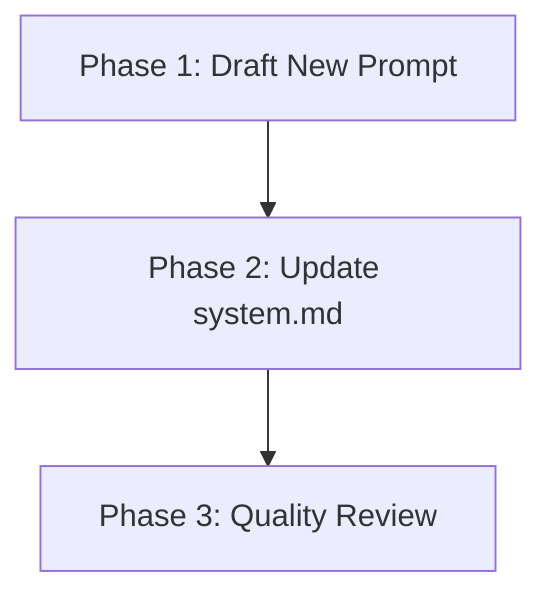

# Implementation Plan: Update Magenta System Prompt

## Plan Overview
This plan outlines the steps to update the core system prompt (`system.md`) for the Magenta framework. The goal is to refine the "Magenta" persona (tempered servant, blunt, pragmatic) while integrating modern tool-calling logic (Verify-Act-Verify) and balancing brevity in interactions with exhaustiveness in technical work.

- **Total Phases**: 3
- **Agents Involved**: `technical_writer`, `coder`, `code_reviewer`
- **Estimated Effort**: Low (Single-file update)

## Dependency Graph

## Execution Strategy Table
| Stage | Phase | Agent | Files Affected | Execution Mode |
|-------|-------|-------|----------------|----------------|
| 1 | 1: Draft | technical_writer | None (Internal Draft) | Sequential |
| 2 | 2: Update | coder | `configs/prompts/base/system.md` | Sequential |
| 3 | 3: Review | code_reviewer | `configs/prompts/base/system.md` | Sequential |

## Phase Details

### Phase 1: Draft New Prompt
- **Objective**: Create the final text for the new system prompt adhering to the ~1200 character limit and the "Magenta Standard" design.
- **Agent Assignment**: `technical_writer`
- **Implementation Details**: 
    - Incorporate "Magenta" identity: tempered servant, blunt, dry, pragmatic.
    - Define Tool Strategy: Verify-Act-Verify.
    - Specify Brevity Rules: Minimalist in interaction, exhaustive in work results.
    - Ensure tone is Rocky Horror-inspired but safe and professional.
- **Validation Criteria**: Text meets all design requirements and character count constraints.
- **Dependencies**: None.

### Phase 2: Update system.md
- **Objective**: Apply the drafted prompt to the configuration file.
- **Agent Assignment**: `coder`
- **Files to Modify**:
    - `configs/prompts/base/system.md`: Replace entire content with the Phase 1 draft.
- **Validation Criteria**: File exists and content matches the approved draft.
- **Dependencies**: Blocked by Phase 1.

### Phase 3: Quality Review
- **Objective**: Final verification of the new prompt within the codebase context.
- **Agent Assignment**: `code_reviewer`
- **Implementation Details**:
    - Review the prompt for persona consistency.
    - Check for potential ambiguities in tool-use instructions.
    - Verify character count (~1200 chars).
- **Validation Criteria**: No Critical or Major findings.
- **Dependencies**: Blocked by Phase 2.

## File Inventory
| File Path | Phase | Purpose |
|-----------|-------|---------|
| `configs/prompts/base/system.md` | 2, 3 | Core system prompt for the Magenta framework. |

## Risk Classification
- **Phase 1**: LOW - Content drafting.
- **Phase 2**: LOW - Simple file overwrite.
- **Phase 3**: LOW - Verification.

## Execution Profile
- Total phases: 3
- Parallelizable phases: 0
- Sequential-only phases: 3
- Estimated sequential wall time: 5-10 minutes.

**Total Estimated Cost**: ~$0.05 (Small model turns)
