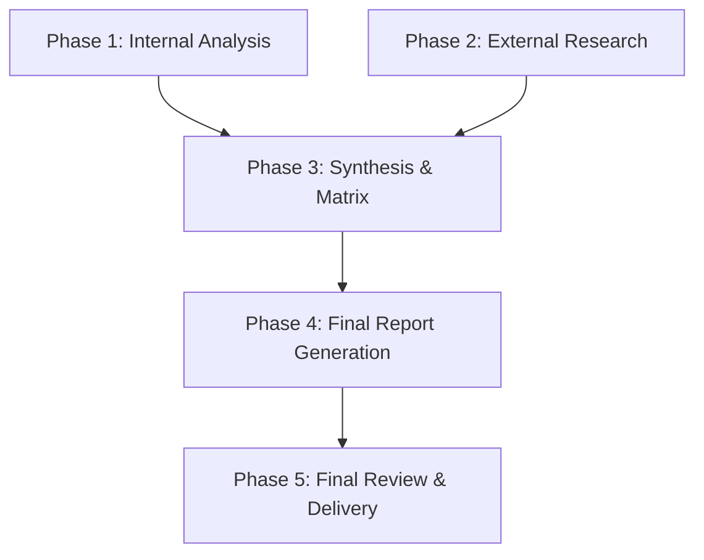

# Implementation Plan: Magenta2 vs. Codex CLI Comparison Report

## 1. Plan Overview
This plan outlines the research, synthesis, and drafting of a comprehensive comparison report between Magenta2 and Codex CLI, focusing on task adherence and workflow management.

- **Total Phases:** 5
- **Agents Involved:** `codebase_investigator`, `generalist`, `technical_writer`
- **Estimated Effort:** Medium

## 2. Dependency Graph

## 3. Execution Strategy Table
| Phase | Objective | Agent | Mode |
|-------|-----------|-------|------|
| 1 | Analyze Magenta2 `todo` tool & prompts | codebase_investigator | Parallel (Batch 1) |
| 2 | Research Codex CLI Planning Phase | generalist | Parallel (Batch 1) |
| 3 | Create Feature-Outcome Matrix | technical_writer | Sequential |
| 4 | Draft Full Comparison Report | technical_writer | Sequential |
| 5 | Final Review and Delivery | technical_writer | Sequential |

## 4. Phase Details

### Phase 1: Internal Analysis (Magenta2)
- **Objective:** Deep dive into Magenta2's `todo` tool implementation and `cannabis3.md` prompt discipline.
- **Agent:** `codebase_investigator`
- **Files to Read:**
  - `src/main/java/io/mindspice/magenta/runtime/tools/builtin/TodoTools.java`
  - `configs/prompts/tasks/cannabis3.md`
  - `configs/prompts/base/system.md`
- **Implementation Details:** Analyze how `todo_create`, `todo_list`, and `todo_update` are implemented and how the prompts enforce their use. Identify the "friction points" for models in this granular system.
- **Validation Criteria:** A detailed internal report on Magenta2's task adherence mechanism.
- **Dependencies:** None.

### Phase 2: External Research (Codex CLI)
- **Objective:** Research Codex CLI's 'Planning Phase', `AGENTS.md` context, and `SKILL.md` workflows.
- **Agent:** `generalist`
- **External Resources:**
  - `https://github.com/openai/codex`
  - `codex-rs` repository (core and cli crates)
- **Implementation Details:** Find the specific logic for Codex's Planning Phase. How is the plan generated? How is it stored? How does the agent adhere to it without a granular 'todo' tool?
- **Validation Criteria:** A detailed research summary of Codex CLI's planning and task management.
- **Dependencies:** None.

### Phase 3: Synthesis & Matrix
- **Objective:** Create a side-by-side 'Feature vs. Outcome' matrix comparing Magenta2 and Codex CLI.
- **Agent:** `technical_writer`
- **Implementation Details:** Map granular 'todo' steps from Magenta2 (from `cannabis3.md`) to Planning Phase steps in Codex CLI. Identify which approach provides better "multistep task adherence" for different levels of complexity.
- **Validation Criteria:** Completed Feature-Outcome Matrix.
- **Dependencies:** Phase 1, Phase 2.

### Phase 4: Final Report Generation
- **Objective:** Draft the full comparison report, including recommendations and the future feature roadmap.
- **Agent:** `technical_writer`
- **Implementation Details:** Structure the report according to the design document: Executive Summary, Internal Analysis, External Analysis, Matrix, Recommendations, and Future Roadmap. Ensure the "no over-architected" constraint is met.
- **Validation Criteria:** Drafted comparison report (`.internal-dev/reviews/2026-03-16-magenta-vs-codex-comparison.md`).
- **Dependencies:** Phase 3.

### Phase 5: Final Review & Delivery
- **Objective:** Final review of the report for clarity, accuracy, and adherence to user constraints.
- **Agent:** `technical_writer` (or orchestrator)
- **Implementation Details:** Ensure all user requirements are met. Move the final report to its permanent location.
- **Validation Criteria:** Final report delivered to the user.
- **Dependencies:** Phase 4.

## 5. File Inventory
| File | Phase | Purpose |
|------|-------|---------|
| `.internal-dev/reviews/2026-03-16-magenta-vs-codex-comparison.md` | 4, 5 | Final Comparison Report |

## 6. Risk Classification
- **Phase 1:** LOW (Internal code is accessible)
- **Phase 2:** MEDIUM (External repo is large and complex)
- **Phase 3:** LOW (Synthesis task)
- **Phase 4:** LOW (Drafting task)
- **Phase 5:** LOW (Finalization)

## 7. Cost Estimation Summary
| Phase | Agent | Model | Est. Input | Est. Output | Est. Cost |
|-------|-------|-------|-----------|------------|----------|
| 1 | codebase_investigator | Flash | 5000 | 1000 | $0.01 |
| 2 | generalist | Flash | 10000 | 2000 | $0.02 |
| 3 | technical_writer | Flash | 5000 | 1000 | $0.01 |
| 4 | technical_writer | Pro | 10000 | 5000 | $0.30 |
| 5 | technical_writer | Flash | 2000 | 500 | $0.01 |
| **Total** | | | **32000** | **9500** | **$0.35** |

Note: Cost estimates are based on token counts and model rates. Buffer added for potential retries.
