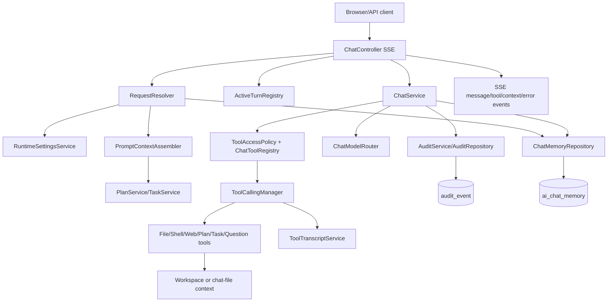
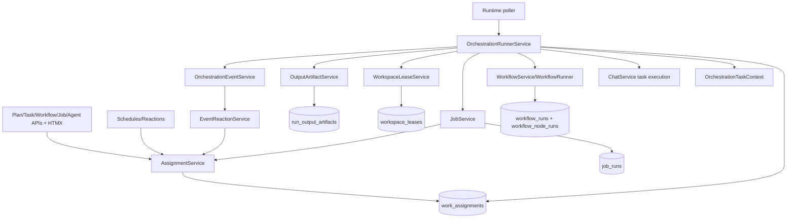
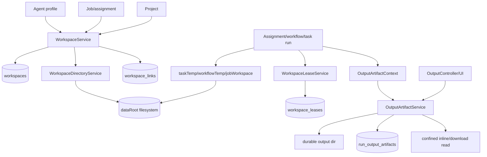
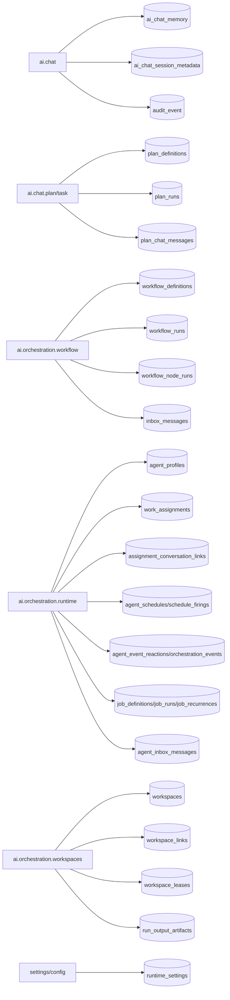

# Service Architecture System Map

## Scope

This artifact maps the reviewed Magenta service architecture and shows the major integration paths between API/controllers, chat, tools, plans/tasks, runtime assignments, workflows, jobs, workspaces, outputs, settings, and persistence.

## Findings

### High-Level Domain Map

- `api.web`: REST/SSE/HTMX transport, selectors, stream helpers, browser shell and fragments.
- `ai.chat`: chat turns, prompt/context assembly, memory, audit, model routing, tools, plan/task chat hooks.
- `ai.chat.plan` and `ai.chat.task`: session plans, saved task templates, plan/task runs, validation/evidence state.
- `ai.chat.tool`: registered Spring AI tool callbacks, file/shell/web/plan/task/question tools, transcript retention.
- `ai.execution`: active turn registry, per-conversation coordination, shared executor concepts.
- `ai.orchestration.runtime`: assignments, jobs, schedules, reactions, events, projects, direct-line inbox.
- `ai.orchestration.workflow`: workflow definitions, graph validation, runs, node runs, workflow inbox, runner.
- `ai.orchestration.workspaces`: workspace records, confined filesystem paths, links, leases, output artifacts.
- `ai.orchestration.settings` and `ai.config.user`: runtime defaults plus file-backed model/provider configuration.
- Repositories and `schema.sql`: SQLite persistence shape and warm database compatibility bootstrap.

### Chat Turn / Context / Tool / Audit Flow

### Assignment / Job / Workflow Execution Flow

### Workspace / Output / Artifact Flow

### Persistence Ownership Map

## Risk Assessment

The diagrams show healthy package separation, but the runtime contracts are not equally explicit. Execution, workspace, output, and audit state cross package boundaries through records and JSON payloads without enough validation at the handoff points.

The highest-risk edges are:

- `WorkflowRunner` called from assignment execution while also owning async execution.
- `AssignmentService` accepting `workspaceId` without workspace validation.
- `ChatService` plain and tool streaming paths persisting different state.
- `OrchestrationController` reconstructing records instead of delegating complete domain mutations.
- Repository delete/purge paths relying on callers or FKs inconsistently.

## Recommendations

- Treat the system maps as the baseline contract for remediation plans.
- Add narrow integration tests around every red-edge handoff: assignment to workflow, assignment to job, workflow to outputs, chat to audit, runtime settings to tools, and owner delete to workspace cleanup.
- Keep workflow and runtime inbox tables separate; that split is sound and should not be collapsed.

## Follow-ups

- Convert these diagrams into permanent technical docs after remediation decisions are made.
- Add a table-level owner appendix to `docs/technical/data-model.md` once schema cleanup is complete.
